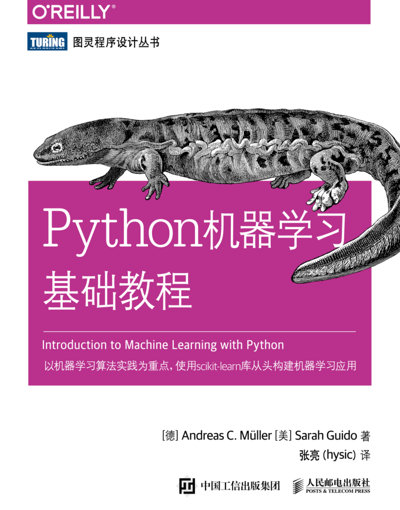

# Introduciton-2-ML-with-Python-notebook
Python机器学习基础教程中文Notebook

基本上就是《Python机器学习基础教程》的内容搬运为`jupyter notebook` ，便于自己记录和学习。

## 快速开始

1. 在含有`.ipynb` 文件的目录下打开命令行
2. 敲入`jupyter notebook`(前提是安装了，Anaconda发行版python自带ipynb)
3. 打开浏览器：`localhost:8888`

